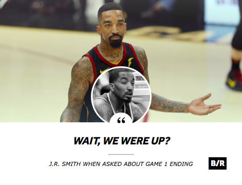

# fake_bleacher_report

Simple Web app allowing you to create fraudulent images that
look like real player quotes from Bleacher Report.

## Usage
1. Click either the background image or headshot. A dialog
will pop up allowing you to select an image.
2. Click either the title or subtitle; both are `textarea`
elements, and thus can be edited freely.
3. Take a screenshot of the page.
4. Crop out the browser address bar, etc.
5. Profit.
6. Make a fake Woj account